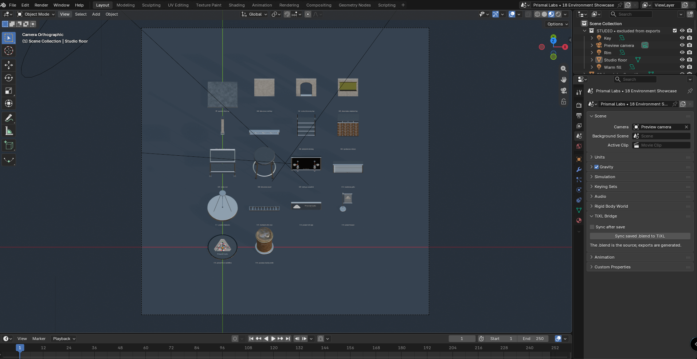
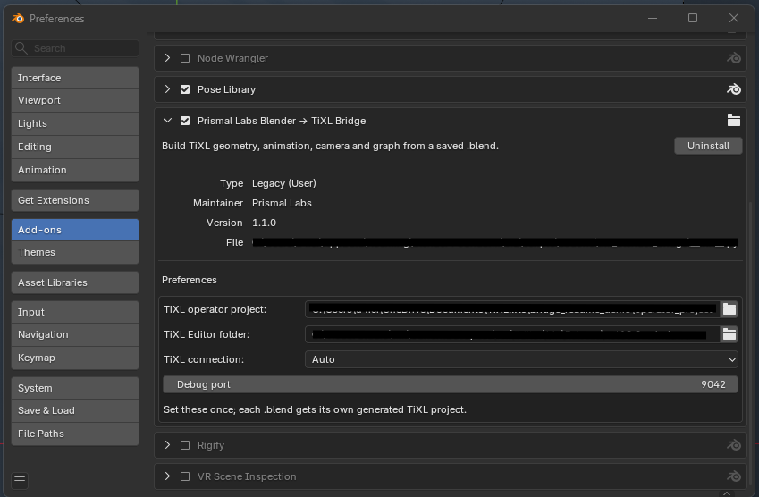
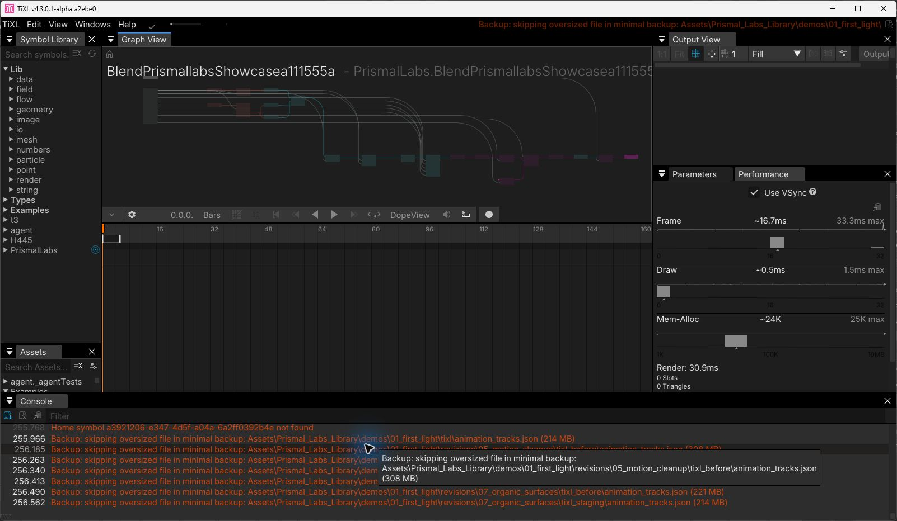
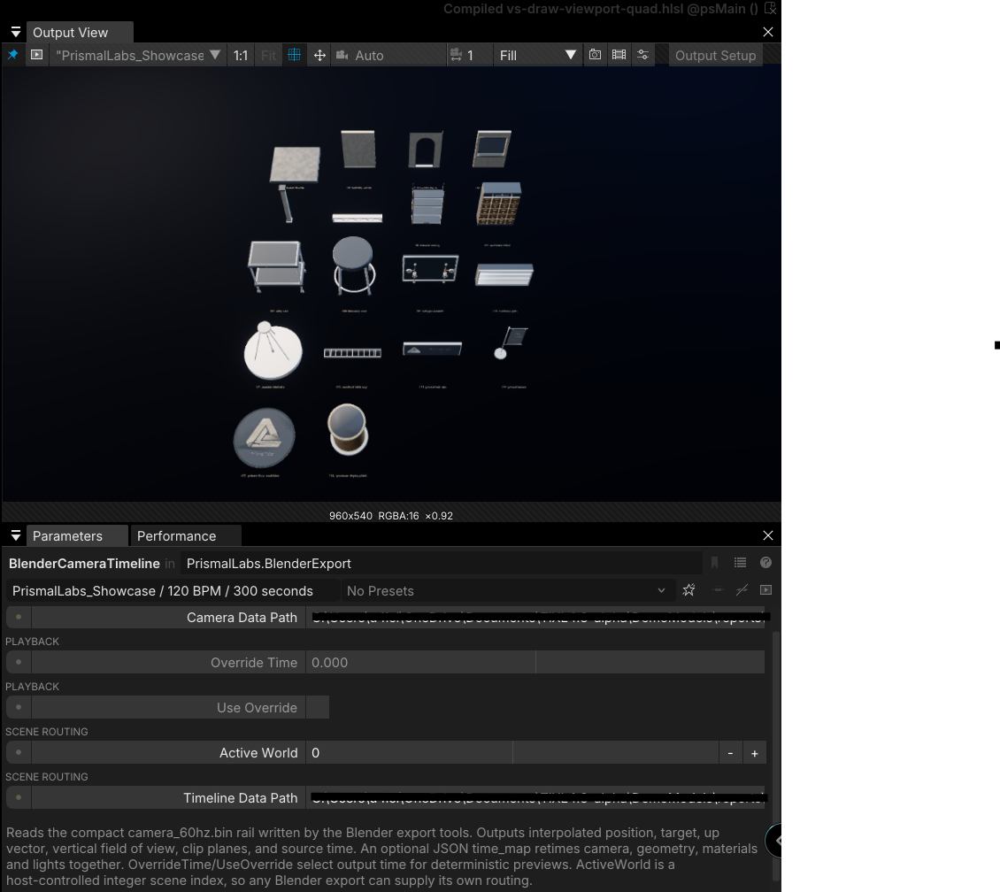

** WARNING: This is a very early experimental project. It is not yet ready for production use. Back up your current existing projects first. **

# Blender → TiXL Bridge

Edit a scene in Blender, save its `.blend`, and let the bridge build the TiXL version in the background. **The `.blend` is the file you manage.** GLB meshes, animation data, camera samples, lights, and a TiXL graph are generated caches.

This repository contains the Blender add-on and three reusable TiXL operators: **Blender Animation Scene**, **Blender Camera Timeline**, and **Blender Export Lights**. They are shared by every generated project; none is tied to a particular demo.

## Set up once (Windows)

You need Blender 4.3 or newer (tested with 5.2), a TiXL Editor build, a TiXL C# operator project, and the .NET SDK. Create the operator project once in TiXL so it has valid release metadata. You can then close TiXL; **the debug server is optional**.

1. Download or clone this repository. In Blender, open **Edit → Preferences → Add-ons → Install from Disk**, choose **`tixl_blender_bridge.zip`**, and enable **Prismal Labs Blender → TiXL Bridge**. (In Blender versions that call it **Get Extensions**, use **Install from Disk** there.)
2. Open the add-on preferences and set **TiXL operator project** to the folder containing your TiXL `.csproj` and `Symbols` folder. Set **TiXL Editor folder** to the build folder containing `TiXL.exe`. Leave **TiXL connection** on **Auto** unless you want to force a mode.
3. Open any Blender project with an active camera. In **Scene Properties → TiXL Bridge**, turn on **Sync after save**. Save the `.blend`.

The first save can take a while. Watch `<blend folder>/.tixl_cache/<blend name>/sync_logs/latest.log`. The bridge installs the operators, creates a TiXL project for this `.blend` from your TiXL-created project scaffold, and builds it. The project is created beside the operator project; its exact path is recorded in `.tixl_cache/<blend name>/tixl_project.json`. In offline mode, **select the generated project once in TiXL**. In debug mode, the bridge opens it for you. Later Blender saves rebuild changed content automatically. TiXL may restart to load new files, so save any open TiXL work first. The **Sync saved .blend to TiXL** button runs the same process on demand.

**Daily use:** work in Blender and save. You do not need to export or import binary files by hand. A failed rebuild keeps the previous validated cache.

## TiXL connection modes

| Mode | Best for | What happens after a save |
| --- | --- | --- |
| **Auto** (default) | Most users, including release builds | Uses the debug bridge if one answers on the configured local port; otherwise builds offline. |
| **Offline** | Release builds without a debug server, or users who do not want a control socket | Writes and builds the project directly. TiXL restarts when files change; select a new project once. |
| **Debug bridge** | Live development | Reloads the loaded TiXL projects and opens the generated graph without restarting on routine saves. It requires an editor build with the opt-in debug protocol. |

To use live mode, start TiXL with `--debug-server 9042`, or select **Debug bridge** in the add-on preferences and let the bridge launch TiXL on the first build. The port is configurable there. The debug server listens on your own computer; it is not required to export a release-build project. If a particular TiXL release has no debug protocol, **Auto** uses offline mode.

## What comes across

- Meshes and UV textures in GLB; PBR material properties supported by Blender's glTF export.
- Object transforms, visibility, shape keys, material color and emission, and lights sampled at 60 Hz.
- The active camera, including camera-bound timeline markers for cuts.
- A generated TiXL graph with one branch per Blender world, camera movement, scene switching, rendering, and final output resolution control.

By default the active Blender scene is one TiXL world. To use several worlds, add a **Scene custom property** named `tixl_worlds` containing JSON like this:

```json
[
  {"name":"lab","collection":"Lab","start_seconds":0,"end_seconds":30},
  {"name":"culture","collection":"Culture","start_seconds":30,"end_seconds":60}
]
```

The named collections must exist. Keep the time ranges contiguous; the generated graph switches branches at their boundaries. Camera markers can control the view independently.

## See the bridge in action

In Blender, open the **Scene Properties → TiXL Bridge** panel and run **Sync saved .blend to TiXL** (or enable **Sync after save**). The add-on reads the saved scene and builds its generated project. Open that project in TiXL to inspect the graph created from the same `.blend` file.



*Blender: the saved scene and the controls used to sync it to TiXL.*



*Blender preferences: select the TiXL operator project and editor folder, then choose Auto, Offline, or Debug bridge mode.*



*TiXL: the generated graph, including the Blender camera timeline and scene export nodes.*



*TiXL: the generated scene output alongside the reusable Blender Camera Timeline operator, which reads the exported camera rail and supports scene routing.*

## Where things go

The authored `.blend` stays where you saved it. Generated data, logs, and the TiXL project link live in `.tixl_cache/<blend name>/` beside it. A newly generated TiXL project is created beside the operator project. **Do not edit generated graphs or cache files**; the next save may replace them.

This is a save-driven build, not direct `.blend` playback inside TiXL. Blender shaders and World nodes that glTF cannot represent need TiXL-side equivalents. In particular, arbitrary procedural materials and physical refraction are not guaranteed to match Blender.

## Command line / troubleshooting

When updating this add-on from a checkout, copy the updated plugin into Blender and enable it with one command. Close Blender first if it is running, then run this from the repository folder using the Blender executable on your machine:

```powershell
& "<path-to-blender.exe>" --background --python install_blender_addon.py
```

This copies the current `tixl_blender_bridge/` package, checks every copied file, and enables the add-on. It saves first-install settings and keeps existing TiXL paths and connection mode on later updates. On a first install, either set those paths in Blender's add-on preferences or pass `-- --operator-project "C:\path\to\OperatorProject" --editor-dir "C:\path\to\TiXL\Editor\build"` after the script name. Restart any Blender window that was already open. Rebuild the distributable ZIP with `python build_addon_zip.py` whenever package files change.

The Blender add-on runs `tixl_blender_bridge/source/blend_sync.py` using Blender's bundled Python. For a cache-only build, set `TIXL_BRIDGE_BLENDER` to your Blender executable and run:

```powershell
python tixl_blender_bridge/source/blend_sync.py sync --blend C:\path\scene.blend --no-install
```

`status --blend ...` checks whether the cache matches the saved file. `--force` rebuilds even when the source hash matches. A full command-line TiXL installation also needs `TIXL_BRIDGE_OPERATOR_PROJECT` and `TIXL_BRIDGE_EDITOR` set to the same folders used in the add-on preferences. `TIXL_BRIDGE_MODE` selects `auto`, `offline`, or `debug`; `TIXL_BRIDGE_PORT` changes the local port. Set `TIXL_BRIDGE_LAUNCH_EDITOR=0` if you want the bridge to build files without starting TiXL.

If a save does not appear in TiXL, check `sync_logs/latest.log` first. Missing cameras, missing collections, and a project without release metadata are reported there. In offline mode, newly created projects require a one-time selection in TiXL.

## Package layout

- `tixl_blender_bridge/__init__.py` — Blender add-on and save handler.
- `tixl_blender_bridge/operators/` — reusable TiXL `.cs`, `.t3`, `.t3ui` operators.
- `tixl_blender_bridge/source/` — exporter, validation, graph generation, and TiXL installation.
- `tixl_blender_bridge/templates/` — internal graph template; never install it as a TiXL project.
- `build_addon_zip.py` — reproduces the installable ZIP.
- `install_blender_addon.py` — copies, enables, and verifies this checkout in local Blender.

The add-on currently targets Windows TiXL builds. Its background exporter does not run during TiXL render frames.

## Example of what's possible
- This would take my machine ~2 hours to render at 540p in blender. But realtime playback in TiXL: https://www.youtube.com/watch?v=vMnAAbqIr74
- All animation is done in blender and exported to TiXL.