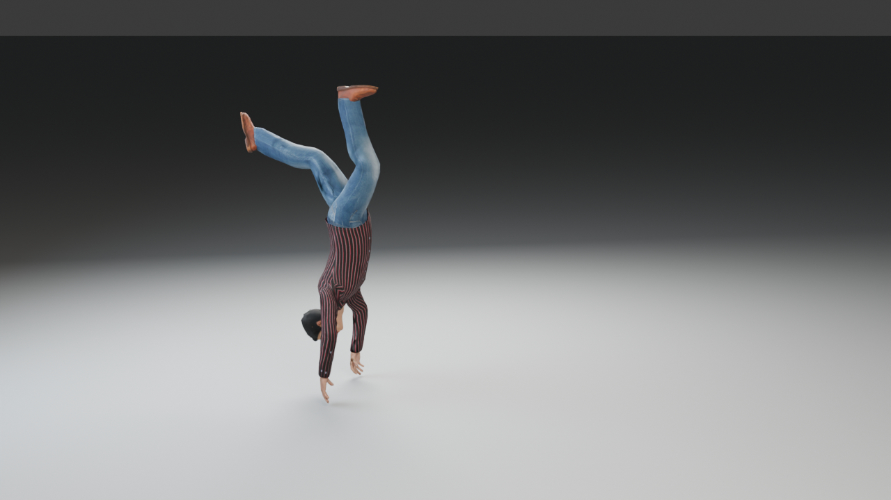
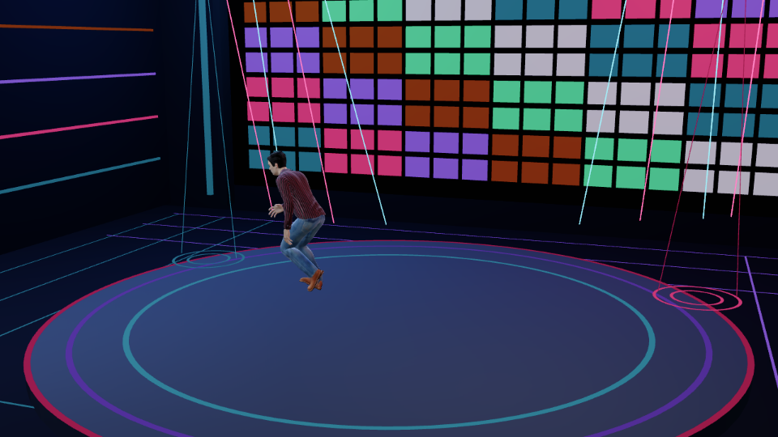
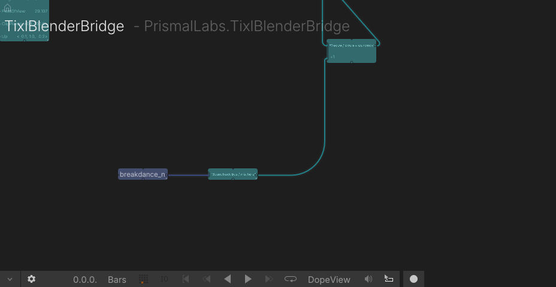

# Two-minute breakdance bridge example



`humanoid_breakdance.blend` is a 120-second, 60 fps performance by a textured
MPFB/MakeHuman character. Ten CMU motion capture takes drive the dance. The
Blender scene contains an editable **163-bone MPFB default rig**, including
individual finger and toe bones, in the hidden `Authoring` collection. Unhide
that collection and hide the visible `Move` collections to inspect or edit the
skeletal animation without seeing overlapping characters. Finger motion is
added in the builder: CMU's source recordings did not capture fingers.

The visible `Move 01` through `Move 10` collections hold morph-baked versions
of the character for the current TiXL bridge runtime. Adjacent short moves
share a world, giving eight TiXL worlds for ten moves. All used textures are
packed in the `.blend`.

| Time | Move | CMU take |
| --- | --- | --- |
| 0:00–0:13 | Upright opening | 85_03 |
| 0:13–0:28 | Fancy footwork | 85_04 |
| 0:28–0:40 | Helicopter | 85_08 |
| 0:40–0:50 | Handstand kicks | 85_05 |
| 0:50–1:00 | Kick flip | 85_06 |
| 1:00–1:04 | Motorcycle freeze | 85_09 |
| 1:04–1:18 | Upright variation | 85_11 |
| 1:18–1:36 | Long break combo | 85_12 |
| 1:36–1:54 | Break sequence with flips | 85_14 |
| 1:54–2:00 | Finale | 85_10 |

## Open and sync

Open `humanoid_breakdance.blend` in Blender and play frames 1–7201. Timeline
markers name the moves and switch among three studio cameras. The bridge add-on
has **Auto sync on save** enabled in this scene. In its preferences, select the
operator project and **Debug bridge**. Use **Sync saved .blend to TiXL** to
regenerate the runtime cache and open the generated TiXL project. You can also
run this from the repository root:

```powershell
python tixl_blender_bridge/source/blend_sync.py sync --blend examples/humanoid_breakdance.blend --profile generic
```

The bridge writes the generated project location to
`examples/.tixl_cache/humanoid_breakdance/tixl_project.json`. On this
workstation, it uses the TiXL user folder and root namespace
`PrismalLabs.TixlBlenderBridge`. The cache is generated output ignored by Git.
At 120 BPM, the TiXL composition lasts 60 bars (120 seconds).
The TiXL home graph contains ten editable **Blender Source Clip** TimeClips,
one for each move. They feed a global **Blender Clip Sequence** for camera and
world selection, and each clip also feeds the sequence for its own world. The
eight world sequences lead through **Blender World Clip Time** nodes directly
into their **Blender Animation Scene** nodes. Two worlds contain two moves, so
both of their source clips connect to the same world sequence. Move or trim
clips in TiXL to change the performance timing; the default wiring keeps the
camera and all eight worlds in sync. Insert any TiXL float operator on a world
sequence's time wire or between World Clip Time and Animation Scene to retime
one world independently. The same home graph exposes all eight character
mesh branches, materials, lights, cameras, `RenderTarget`, and tone mapping.
Each branch has **Select mesh** and **Replace mesh** nodes. Give both the same
`PrimitiveIndex` (zero selects the character's anatomical mesh), then insert
a TiXL mesh operator between them to edit its vertices or topology. The
**Select mesh** status shows the chosen primitive's name and the total count.
Each branch also has **Select textures** and **Replace textures** nodes.
Route albedo, normal, roughness/metal/occlusion, or emissive `Texture2D` wires
through TiXL image operators to alter the rendered material. The editable
home graph and TimeClips survive later Blender syncs. The first migration
saved the previous home graph under
`examples/.tixl_cache/humanoid_breakdance/project_backups/`.

**Preload all Blender worlds** initializes the eight GLB and animation branches
while TiXL is paused, before the world switch starts playing. The light operator
also reads all eight world light caches on that paused frame. Pause once after
opening the project before pressing play; later scene cuts use resident data.
Syncing a new Blender save waits for a paused TiXL transport before publishing
replacement cache files.

## Nightclub lighting at 120 BPM

The dancer performs on a raised circular stage with perspective floor guides,
a 144-tile LED wall, eight sweeping lasers, two moving projector gobos and
visible beam edges, and six animated lights. The wall, stage rings, lasers,
projectors, and light levels are keyed to a **120 BPM grid**: beat one is frame
1, each beat is 30 frames (0.5 seconds), and the two-minute performance has
240 beats. The TiXL composition also runs at 120 BPM. The original soundtrack
starts at composition time zero and changes arrangement at all ten movement
boundaries.



To replace the set in the saved `.blend` without rebaking the character, run:

```powershell
blender --background examples/humanoid_breakdance.blend --python examples/decorate_nightclub.py
```

The set builder is idempotent and is also called by `build_breakdance.py`.
After saving, run the bridge sync again. Check the beat grid, shared world
geometry, animated lights, and stage coverage with:

```powershell
blender --background examples/humanoid_breakdance.blend --python examples/validate_nightclub.py
```

## Original 120 BPM soundtrack

Run `python examples/build_soundtrack.py` to create
`audio/breakdance_nightclub_120bpm.wav`, a two-minute stereo score built for
the ten dance TimeClips. It has a 90s deep drum-and-bass / breakbeat sound at
the project's fixed 120 BPM: swung sixteenth-note breaks played from
[recorded Pearl acoustic drum hits](audio/drums/README.md), ghost snares,
detuned Reese bass, sub bass, Rhodes-style keys, and dub delays. The builder
adds no continuous static or vinyl-crackle layer. The arrangement
gets denser through the footwork and aerial moves, drops the break for the
1:00–1:04 motorcycle freeze, then builds into the finale. The 0.5-second beat
grid also matches the LED wall and lights. The generated companion `*.cues.json` lists
the exact movement boundaries and levels.

In the TiXL home graph, **Soundtrack / 120 BPM / ten movements** is an editable
`AudioClip` spanning 60 bars. Its `AudioReference` feeds **Soundtrack bus / mix
here**, whose `Result` feeds **Execute / picture + soundtrack** alongside the
render command. The Execute output enters the final `RenderTarget` command
input, so the bus is evaluated with the picture. The AudioClip uses the
project's `Assets/audio/` copy of the WAV. Adjust its timing, replace the file,
or insert TiXL audio effects before the bus in the same graph. The continuous
file avoids a new audio source load at each movement cut.

To regenerate the score and install it into an existing TiXL user project,
close TiXL and run:

```powershell
python examples/build_soundtrack.py
python examples/install_soundtrack.py --project "C:\path\to\TixlBlenderBridge"
```

Then launch TiXL with `--debug-server 9042` and open `TixlBlenderBridge`.
The installer preserves an existing soundtrack graph and saves the prior home
symbol in `examples/.tixl_cache/soundtrack_backup/` when it first adds the nodes.



## Rebuild

`build_breakdance.py` rebuilds the Blender scene and nightclub from the source BVH files in
`mocap/`. It needs Blender 5.2, [MPFB](https://extensions.blender.org/add-ons/mpfb/),
and the CC0 [MakeHuman system assets and skins02 packs](https://static.makehumancommunity.org/assets/assetpacks.html)
installed through MPFB. Run:

```powershell
blender --background --python examples/build_breakdance.py
```

The builder drives both deform bones of each upper arm and forearm from the
captured limb direction while preserving the MPFB rig's anatomical bone roll.
The source BVH has zero-length hand bones, so the wrists follow the forearms
instead of inheriting unreliable hand rotations. The first frame is the capture's
T-pose reference. `breakdance_tpose.png`, `breakdance_tpose_side.png`, and
`breakdance_tpose_elevated.png` show it from three angles; the other
`breakdance_*.png` files sample the dance in Blender.

After rebuilding, check the T-pose and dance frames with:

```powershell
blender --background examples/humanoid_breakdance.blend --python examples/validate_breakdance.py
```

This check compares the saved rig against the BVH arm directions, verifies
neutral wrist rotation and T-pose limb placement, and checks floor contact at
0, 2, 45, 83, 100, and 116 seconds. `tixl_breakdance_*.png` are corresponding
screenshots captured through TiXL's debug bridge after export.

The source recordings are CMU Graphics Lab [subject 85](https://mocap.cs.cmu.edu/search.php?subjectnumber=85),
converted to BVH by Bruce Hahn. CMU permits use of the motions in projects,
including commercial projects, while prohibiting resale of the motion data
itself. See the [CMU database terms](https://mocap.cs.cmu.edu/) and the
[conversion repository](https://github.com/una-dinosauria/cmu-mocap).
