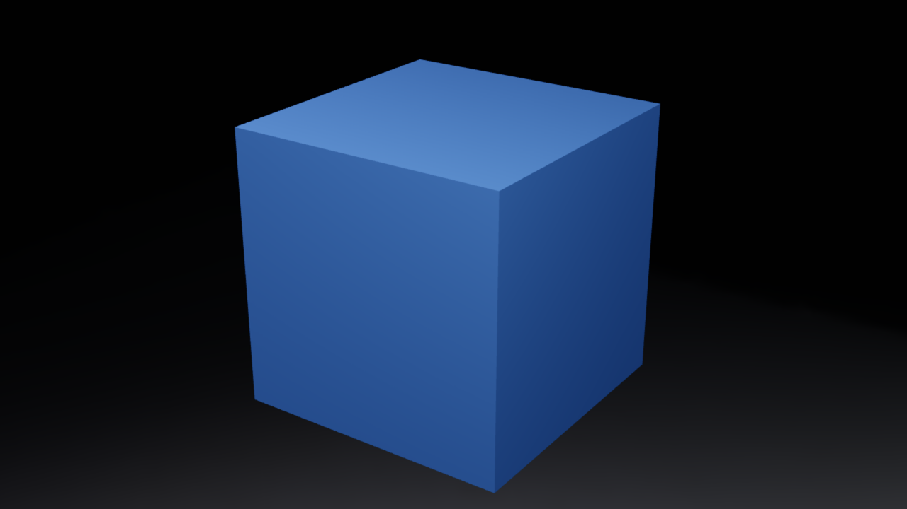
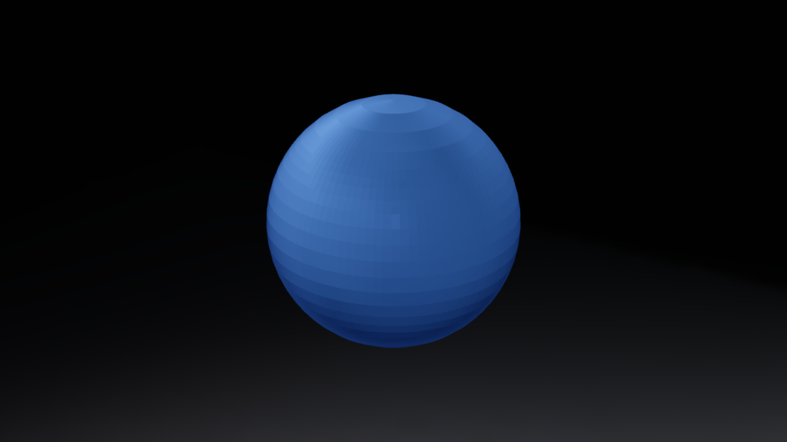
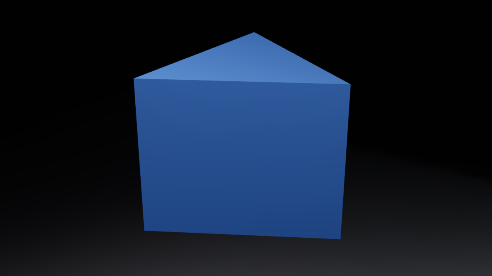
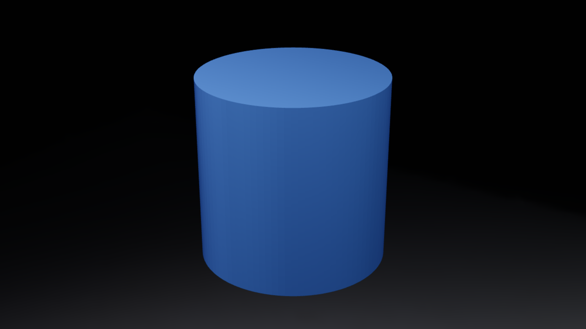
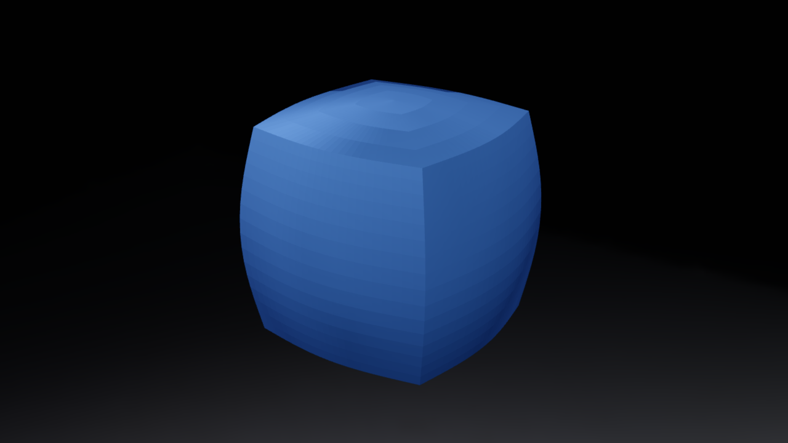

# BlendShapeExample

Open `BlendShapeExample.blend` in Blender and run **Scene Properties → TiXL Bridge →
Sync saved .blend to TiXL** after configuring the add-on. Use the generated
**BlendShapeExample** TiXL project at its default **120 BPM**. Loop bars **0–8**
(seconds **0–16**). The saved scene's `tixl_project_name` property supplies the
project name on the first sync.

## Screenshots

These screenshots show BlendShapeExample rendered in TiXL after syncing its Blender source. Four scenes morph in sequence—cube → sphere → triangular prism → cylinder → cube—over a 16-second loop at 120 BPM. All four meshes are centered at `(0, 0, 0)`.

| Cube · 0 seconds | Sphere · 4 seconds |
| --- | --- |
|  |  |
| **Triangular prism · 8 seconds** | **Cylinder · 12 seconds** |
|  |  |

The geometry changes continuously between scenes. At 3 seconds, the cube is midway through its morph into the sphere:



| Source time | World | Transition |
| --- | --- | --- |
| 0–4 s | Cube | Cube → sphere |
| 4–8 s | Sphere | Sphere → triangular prism |
| 8–12 s | Prism | Triangular prism → cylinder |
| 12–16 s | Cylinder | Cylinder → cube |

Each world holds its starting shape for four beats and morphs over the next
four beats. All mesh origins remain at `(0, 0, 0)`. The targets use identical
closed mesh topology, so the end of each morph matches the next world's mesh.
There is no audio dependency; timing is authored at 60 FPS, with 30 frames per
beat. The four collections become four TiXL worlds and four editable source clips.

The release ZIP includes this file and the `.blend` under
`blender_tixl_bridge/examples/`. From a checkout, rebuild the source with:

```powershell
& "<path-to-blender.exe>" --background --python examples/build_blend_shape_example.py
& "<path-to-blender.exe>" --background examples/BlendShapeExample.blend --python examples/validate_blend_shape_example.py
```

Generated `.tixl_cache` files and local TiXL projects are rebuilt by the bridge
and are not distributed. The builder resets only its current Blender session;
run it in a separate background process as shown above.
